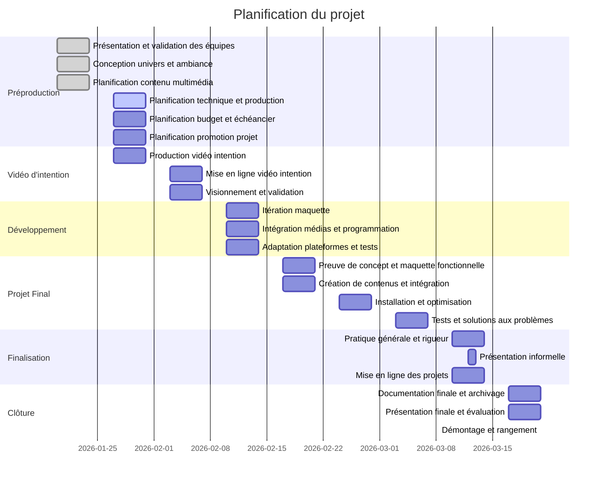

# Échéancier

## Gantt

## Tableau par semaine

| Semaine | Dates          | À préparer durant la semaine                           | Savoirs essentiels / Activités en classe |
|---------|---------------|-------------------------------------------------|---------------------------------|
| 1       | 20-24 Jan     | Réalisation de la préproduction                  | Présentation du cours, validation des équipes, conception de l’univers et de l’ambiance, planification du contenu multimédia. Inscription hebdomadaire à la documentation Web (individuel et en équipe). |
| 2       | 27-31 Jan     | Réalisation de la préproduction, production de la vidéo d’intention | Planification technique et détermination des problèmes de production potentiels, planification du budget et de l’échéancier de réalisation, planification de la promotion du projet. Inscription hebdomadaire à la documentation Web (individuel et en équipe). |
| 3       | 03-07 Fév     | Mise en ligne de la vidéo d’intention           | LUNDI : Visionnements en classe des vidéos d’intention, proposition créative, validation direction artistique site Web, thématique et type d’événement de diffusion. Inscription hebdomadaire à la documentation Web (individuel et en équipe). |
| 4       | 10-14 Fév     | Réalisation d’une itération de la maquette, mise en ligne | Classement des médias, programmation d’éléments et intégration des médias, installation et adaptation aux différentes plateformes, application de tests de contrôle de la qualité et proposition de solutions aux problèmes rencontrés. Inscription hebdomadaire à la documentation Web (individuel et en équipe). |
| 5       | 17-21 Fév     | Réalisation du projet final                     | LUNDI : Présentation en classe de la preuve de concept et de la maquette fonctionnelle. LUNDI : Évaluation de la contribution individuelle au travail d’équipe (formatif). Réalisation, création de contenus, programmation de l’interactivité et intégration des médias. Proposition créative et esthétique, rigueur, esprit d’équipe et débrouillardise. Inscription hebdomadaire à la documentation Web (individuel et en équipe). |
| 6       | 24-28 Fév     | Réalisation du projet final                     | Installation et adaptation aux différentes plateformes du produit multimédia, vérification de la qualité des médias, conception d’éléments médiatiques et optimisation en fonction de la diffusion. Inscription hebdomadaire à la documentation Web (individuel et en équipe). |
| REL.    | 03-07 Mars    | Réalisation du projet final                     | Application de tests de contrôle de la qualité, proposition de solutions aux problèmes rencontrés. |
| 7       | 10-14 Mars    | Réalisation du projet final                     | Rigueur, esprit d’équipe et débrouillardise. Pratique générale. MARDI (MIDI) et MERCREDI (PM) : Présentation informelle aux élèves du cours d’œuvre et dispositif multimédia en exposition. Mise en ligne des projets sur site Web. |
| 8       | 17-21 Mars    | Documentation finale et archivage               | LUNDI au VENDREDI : Présentation et documentation des projets. VENDREDI MATIN : Évaluation sommative de la contribution individuelle au travail d’équipe. VENDREDI : Démontage et rangement. |

## Tableau des évaluations

| Description de l’évaluation                          | Savoirs essentiels / Principaux critères d’évaluation | Date de l’évaluation ou de la remise | Pondération |
|----------------------------------------------------|------------------------------------------------------|------------------------------------|-------------|
| **Conception et planification** (Documentation Web et vidéo d’intention) | Intention et concept clair, proposition artistique originale et recherchée, description approfondie de la conception sonore et visuelle, planification détaillée du contenu multimédia à intégrer, planification technique rigoureuse, documentation de la boucle interactive (game loop), qualité visuelle et sonore de la documentation vidéo. Vidéo d’au maximum 5 minutes. | Lundi de la semaine 3 | 15 % |
| **Maquette fonctionnelle** (Présentation de la maquette) | Maquette fonctionnelle avec des médias visuels et sonores substituables et temporaires. | Lundi de la semaine 5 | 30 % |
| **Intégration des apprentissages** (Réaliser et diffuser une expérience interactive - Présentation pendant la semaine) | Aptitudes professionnelles pertinentes et recherchées, démonstration des habiletés et compétences, opération rigoureuse de validation de la qualité, exécution technique précise et achevée, projet artistique riche, inventif et recherché, évaluation de la contribution individuelle au travail d’équipe (Vendredi : évaluation des coéquipiers). | Du lundi au vendredi de la semaine 8 | 35 % * |
| **Documentation en ligne** (Documentation Web, vidéo bande annonce, vidéo « making of ») | Documentation du projet et archivage de qualité, réalisation de 2 vidéos : une bande annonce courte et une autre de type « making of » plus longue, démonstration claire de la boucle interactive (game loop), qualité visuelle et sonore de la documentation vidéo. | Vendredi de la semaine 8 | 20 % * |
| **Total** | | | **100 %** |
